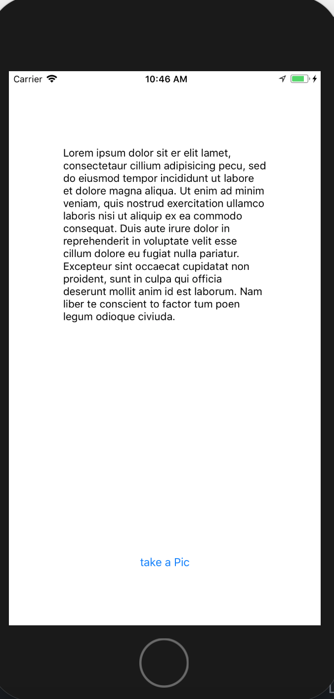
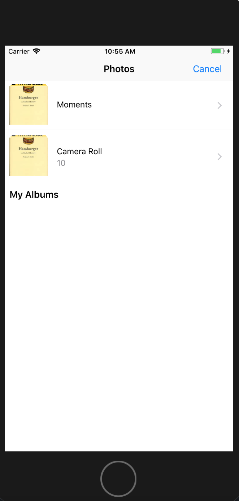
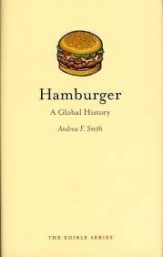
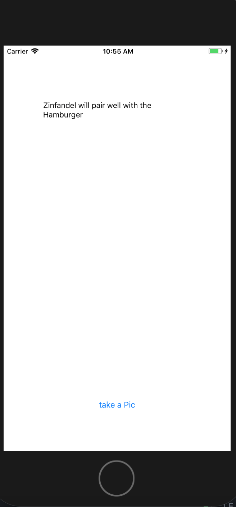

# simple-somm-V2
An iOS app that I'm working on during my free time. In its current state, it can recognize text and if it knows a certain food, it will suggest a wine to pair with it. A work in progress, my next steps are to incorporate coreml and Apple's vision framework and eventually turn this into a full tsack application

# Tech
- Swift
- Optical Character Recognition
- Natural Language Processing 

# Screenshots

